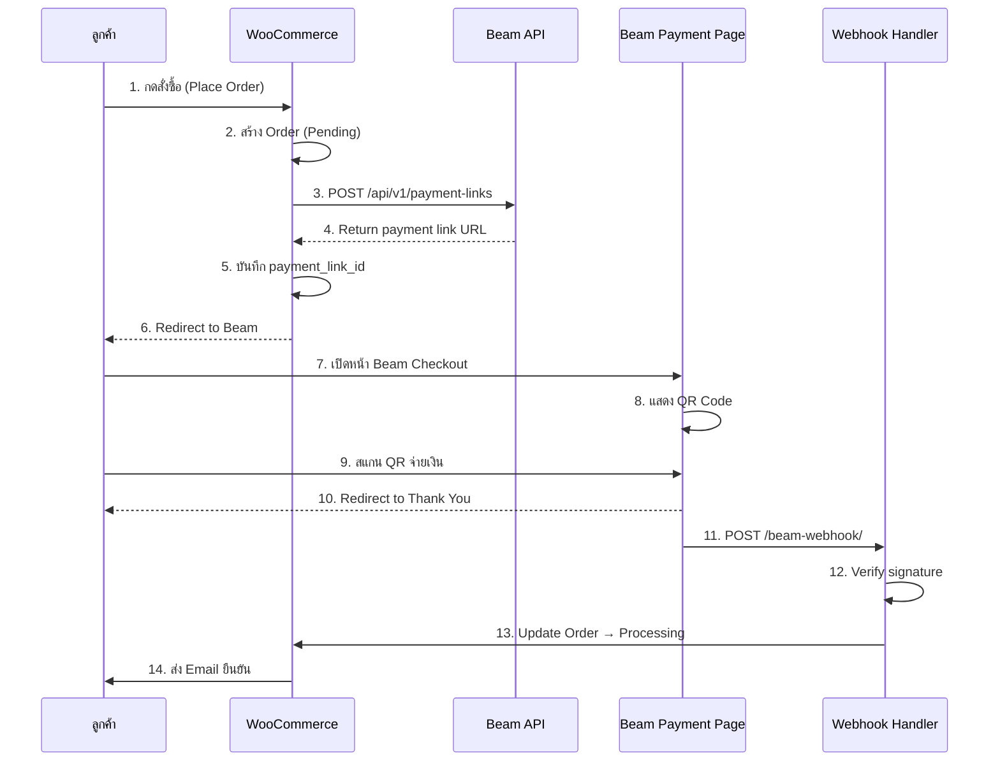
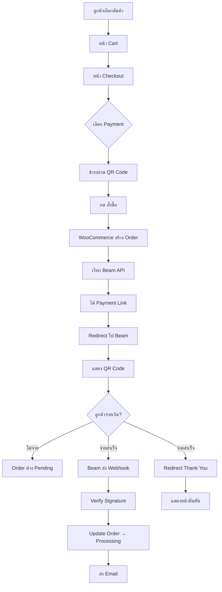
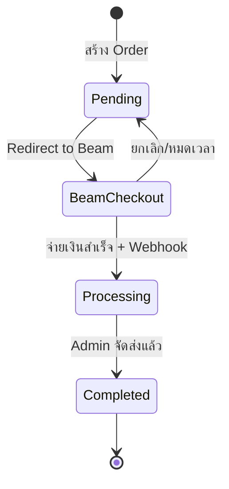

# Beam Checkout Payment Flow

## Sequence Diagram



## Flowchart



## State Diagram



---

## วิธีดู Diagram

### Option 1: Mermaid Live Editor
1. ไปที่ https://mermaid.live
2. Copy code ระหว่าง ```mermaid และ ```
3. Paste ใน editor
4. Export เป็น PNG/SVG

### Option 2: VS Code Extension
1. ติดตั้ง "Markdown Preview Mermaid Support"
2. เปิดไฟล์นี้ใน VS Code
3. กด Ctrl+Shift+V เพื่อ Preview

### Option 3: GitHub
- Push ไฟล์นี้ขึ้น GitHub
- GitHub จะ render Mermaid diagrams อัตโนมัติ

---

## Files ที่เกี่ยวข้อง

| File | หน้าที่ |
|------|--------|
| `inc/class-wc-gateway-beam.php` | Payment Gateway Class |
| `inc/functions-custom.php` | Register Gateway + Webhook |
| `custom-pages/page-checkout.php` | หน้า Checkout |
| `custom-pages/page-order-received.php` | หน้า Thank You |

## Credentials (wp-config.php)

```php
define('MARSX_BEAM_MERCHANT_ID', 'your-merchant-id');
define('MARSX_BEAM_API_KEY', 'your-api-key');
define('MARSX_BEAM_WEBHOOK_SECRET', 'your-webhook-secret');
```

## API Endpoints

| Environment | URL |
|-------------|-----|
| Playground | `https://playground.api.beamcheckout.com/api/v1` |
| Production | `https://api.beamcheckout.com/api/v1` |

## Webhook URL

```
https://marsxthings.com/beam-webhook/
```
